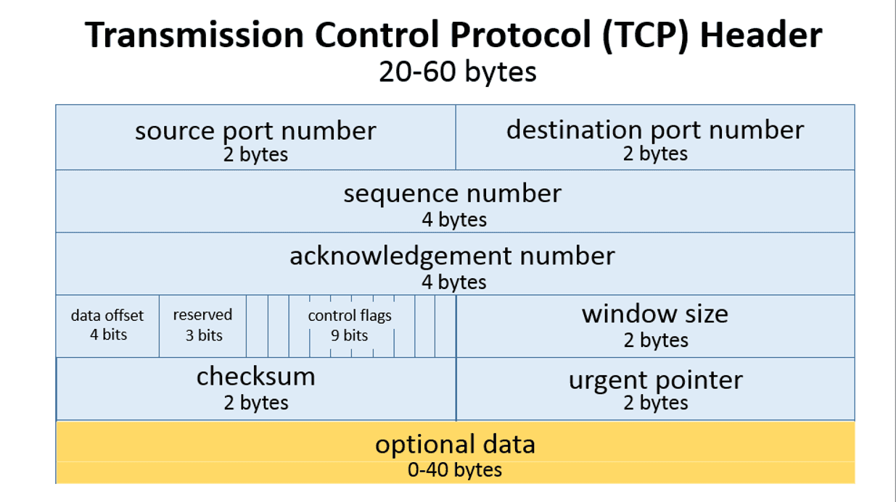

# Sliding Window
> Tugas Besar IF3130 Jaringan Komputer

## Petunjuk Penggunaan Program
Berikut adalah langkah-langkah dalam menjalankan program:
1. Lakukan ekstrak pada file zip `TB1_K03_11_DWI.zip`
2. Buka terminal pada folder hasil ekstraksi
3. Ketik perintah `Make`. Dengan perintah ini, program akan terkompilasi.
4. Pada terminal saat ini, akan digunakan sebagai lokasi eksekusi sender. Ketik perintah berikut: `./sendfile <inputfilename> <windowsize> <buffersize> <destination_ip> <destination_port>`
5. Buka terminal lain sebagai lokasi eksekusi receiver. Kemudian ketik perintah berikut:
`./recvfile <outputfilename> <windowsize> <buffersize> <port>`
6. Untuk mengirimkan data dalam localhost, gunakan `destination_ip = 127.0.0.1` dan pastikan `port` sender sama dengan `port` receiver.

## Cara Kerja Sliding Window
Pertama-tama, program sender akan membuat suatu UDP soket yang akan digunakan dalam komunikasi. Pada receiver, juga dilakuan pembuatan soket. Sender akan membaca file eksternal tiap char dan memasukkannya ke dalam buffer sender. Sebelum tiap data pada buffer dikirimkan, data akan "dibungkus" menjadi suatu segmen. Berikut adalah format segmen:

| SOH(0x1) | Sequence Number | STX(0x2) | Data   | ETX (0x3) | Checksum | 
| -------- | --------------- | -------- | ------ | --------- | ---------|
| 1 byte   | 4 byte          | 1 byte   | 1 byte | 1byte     | 1 byte   |

Checksum didapatkan dari jumlah setiap data yang dikrimkan dari SOH hingga ETX. Setelah segmen terbentuk, data akan dikirimkan pada receiver.

Setelah receiver mendeteksi ada pesan yang masuk, receiver akan melakukan pengecekan terhadap header pesan beserta mengecek apakah sum dari data sama dengan nilai check sum yang dikirimkan. Jika checksum sesuai, berarti data yang diterima benar,dan data dimasukkan ke dalam buffer receiver.

Data dari buffer receiver akan dituliskan ke dalam file output. Jika penulisan ke file output ini sudah berhasil, receiver akan mengirimkan ACK kepada sender. ACK ini berisi sequence number terakhir yang berhasil diterima receiver(terakhir jika dibaca dari seqnum awal, bukan yang benar-benar terakhir diterima. Di dalam segmen ACK ini juga dikirimkan Advertised Windows Size, yaitu banyaknya ruang kosong pada buffer receiver. Sehingga, sender tidak akan mengirimkan data yang banyaknya lebih besar dari Advertised Window Size. Berikut adalah format segmen ACK yang dikirimkan receiver:

| ACK (0x6) | Next Sequence Number | Advertised Window Size  | Checksum |
| --------- | -------------------- | ----------------------- | -------- |
| 1         | 4                    | 1                       | 1        |

ACK ini akan diterima kembali oleh sender dan sender diinformasikan untuk mengirimkan data ke ACK+1. Buffer sender yang memiliki seqnum sesuai dengan ACK yang diterima akan dikosongkan kembali, karena data telah berhasil diterima receiver. 

Proses penulisan data dari file input ke buffer sender akan dilakukan terus hingga akhir file (EOF) selama masih tersedia ruang pada buffer sender. Jika telah ditemukan EOF, sender akan mengirimkan segmen dengan seqnum -1. Jadi jika receiver menerima segmen dengan seqnum 1, receiver akan tahu bahwa itu adalah data terakhir yang dikirim. Proses pengiriman data dari buffer sender ke buffer receiver terus dilakukan selama buffer receiver masih tersedia ruang. Berikutnya, proses penulisan dari buffer receiver ke file system dilakukan hingga buffer receiver kosong.

### Fungsi pada Program
#### sender.c
Berikut adalah fungsi-fungsi pada `sender.c` yang digunakan pada program utama:
*   ` void die(unsigned char *s)`
Digunakan untuk menghntikan eksekusi program akibat terjadinya error
* `   int isbufempty()`
Digunakan untuk mengecek apakah buffer sender kosong
*  `void send_data(unsigned char c)`
Digunakan untuk memasukkan data ke dalam buffer sender
* `int check_checksum(const unsigned char *ack)`
Digunakan untuk menegcek apakah data yang diterima sama dengan checksum yang diterima
* `int check_ACK(const unsigned char *ack)`
Diguakan untuk mengecek apakah terjadi kesalahan pada header atau checksum

#### receiver.c 
Berikut adalah fungsi-fungsi pada `receiver.c` yang digunakan pada program utama:
*   ` void die(unsigned char *s)`
Digunakan untuk menghentikan eksekusi program akibat terjadinya kesalahan
* `   void reset()`
Digunakan untuk melakukan pengaturan ulang (reset) pada LFR (Last Frame Received) dan LAF (Largest Acceptable Frame)
*  `int check_checksum(const unsigned char *buf)`
Digunakan untuk mengecek apakah data yang dikirimkan sesuai dengan data Checksum
* `int check_data(const unsigned char *buf)`
Digunakan untuk mengecek apakah terjadi kesalahan pada SOH, STX, ETX atau checksum
* `int getAWS()`
Digunakan untuk menghitung Advertised Window Size (AWS)
* `int neff_1()`
Digunakan untuk mengembalikan nilai Neff -1. Neff adalah indeks pertama pada receiver buffer yang belum terisi.
* `void recv_data(int sockfd, int flags, const struct sockaddr *dest_addr, socklen_t addrlen)`
Digunakan untuk menuliskan data dari buffer ke file, dan mengirimkan ACK kepada sender

## Pembagian Tugas

| Nama               | NIM      | Keterangan |
| ------------------ | -------- | -----------|
| Dewita Sonya T     | 13515021 |xxxxxxxxxxxx|
| Iftitakhul Zakiah  | 13515114 |xxxxxxxxxxxx|
| William            | 13515144 |xxxxxxxxxxxx|

## Pertanyaan
#### 1. Apa yang terjadi jika advertised window yang dikirim bernilai 0? Apa cara untuk menangani hal tersebut?
Advertised Window merepresentasikan jumlah data yang dapat ditampung oleh receiver. Keadaan dimana advertised window mengecil, disebut Silly Window Syndrome sehingga ukuran data yang dikirim lebih kecil daripada ukuran header yang menyebabkan pengiriman data akan lebih mahal karena banyaknya paket data yang dikirmkan. Terdapat dua cara untuk mengatasi Silly Window Syndrome, yaitu :
1. Langsung mengirim data sebanyak advertised windows
2. Menunggu advertised window sebanyak 1 MSS (Maximum Segment Size)

Jika advertised window yang dikirim sender bernilai nol, maka opsi pertama tidak dapat dilakukan karena tidak ada data yang bisa dikirim. Oleh karena itu untuk menanganinya, receiver menunda pengiriman ACK hingga ukuran window cukup besar.
#### 2. Sebutkan field data yang terdapat TCP Header serta ukurannya, ilustrasikan, dan jelaskan kegunaan dari masing-masing field data tersebut!

* **Source Port Number** (2 bytes)
Digunakan untuk mengidentifikasi sending port
* **Destination Port Number** (2 bytes)
Digunakan untuk mengidentifikasi receiving port
* **Sequence Number**         (4 bytes)
Digunakan untuk menandakan urutan data. 
* **Acknowledgement Number**  (4 bytes)
Sender dan receiver menggunakan ack number untuk meginformasikan sekuens number berikutnya yang diharapkan. 
* **Data Offset**            (4 bytes)
* **Reserved**                (4 bytes)
Untuk penggunaan masa depan, diset 0. 
* **Control Flags**          (9 bytes)
Terdiri dari 9 flag sebagai berikut:
    * NS : ECN-nonce - concealment protection
    * CWR : Congestion Window Reduced flag digunakan untuk mengindikasikan bahwa menerima TCP segment dengan EC Flag set dan telah merespon pada mekanisme congestion control.
    * ECE : ECN-Echo memiliki 2 peran tergantung flag SYN. Jika SYN set, maka TCP Peer ECN-capable. 
    * URG : menandakan Urgent Pointer di set/tidak
    * ACK : mengindikasikan bahwa ACK field signifikan. Semua paket setelah paket insial akan memiliki flag ACK yang bernilai set. 
    * PSH : mengindikasikan Push function. Akan melakukan push pada buffered data ke receiving application.
    * RST : reset the connection, digunakan untuk mereset koneksi TCP akibat error. Jiika receiver menerima RST yang set, receiver meresponnya dengan mengakhiri koneksi(termination).
    * SYN : synchronize sequence number, menandakan bahwa paket ini adalah paket pertama
    * FIN : menandakan paket terakhir dari sender

* **Window Size**             (2 bytes)
Menginformasikan ukuran window yang dapat diterima oleh pengirim segmen
* **Checksum**                (2 bytes)
Digunakan untuk melakukan pengecekan error. Receiver saat menerima data, akan melakukan penghitungan "sum" terhadap data. Jika hasilnya berbeda dengan Checksum, maka terjadi kesalahan.
* **Urgent Pointer**          (2 bytes)
Ketika urgent flag bernilai set, urgent pointer akan menandakan sequence number terakhir dari byte terakhir urgent data.
* **Optional Data**           (0-40 bytes)
Panjang data field ini ditentukan oleh field data offset. Terdapat 3 jenis field pada Optional Data, yaitu:
    * Option-Kind (1 byte)
Mengindikasikan tipe dari option, dan satu-satunya field yang tidak bersifat opsional.
    * Option-Length (1byte)
Mengindikasikan total panjang dari option.
    * Option-Data (panjang bervariasi)
Berisi nilai dari data option. 

    Isi dari optional data antara lain: 
    * 0 (8 bits): End of options list
    * 1 (8 bits): No operation (NOP, Padding) Digunakan ntuk melakukan align option field untuk meningkatkan performansi.
    * 2,4,SS (32 bits): Maximum segment size  
    * 3,3,S (24 bits): Window scale
    * 4,2 (16 bits): Selective Acknowledgement permitted.
    * 5,N,BBBB,EEEE,... (variable bits, N is dapat berisi 10, 18, 26, atau 34)- Selective ACKnowledgement (SACK)
    * 8,10,TTTT,EEEE (80 bits)- Timestamp dan echo dari timestamp sebelumnya
